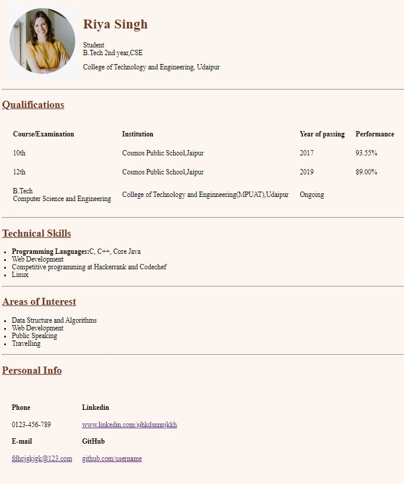

Hey you all! 
It's time for the assignment. You are going to create a portfolio of yourself using html with just a bit of css as you haven't been taught much of css yet. 
Here is the specification you should follow.Try to get the result to look the same as the specification. 
background-color: #FDF6F0
h1 and h2 tag color: #753422

